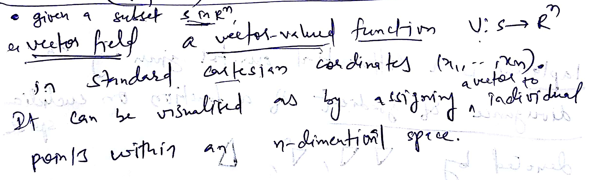
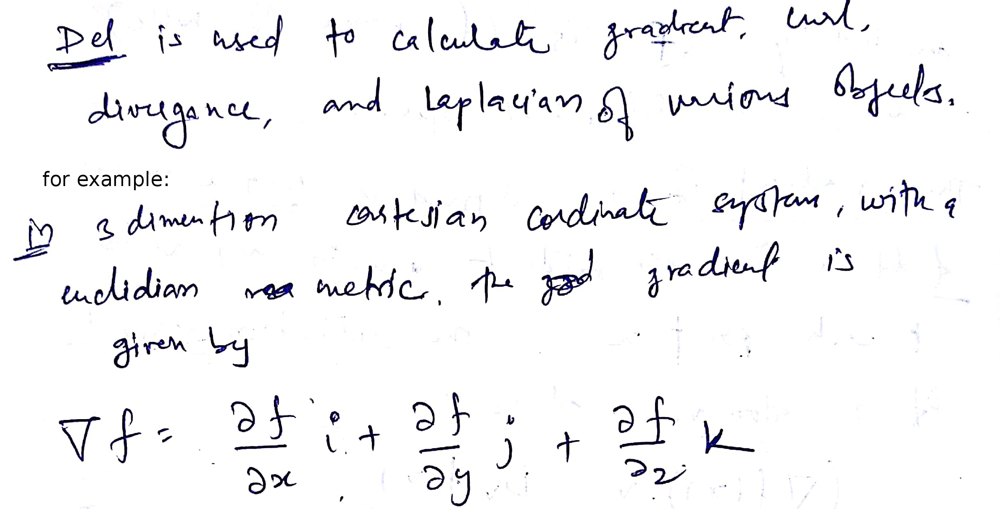
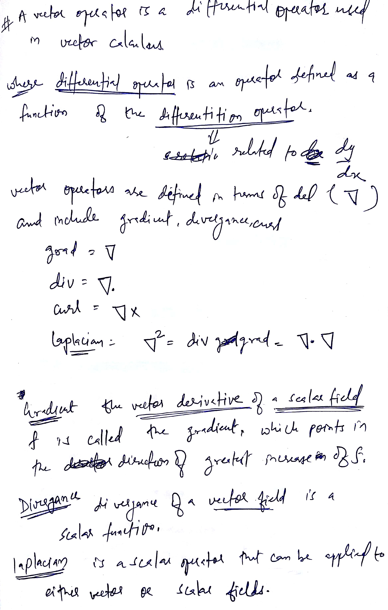
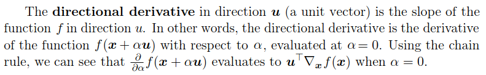
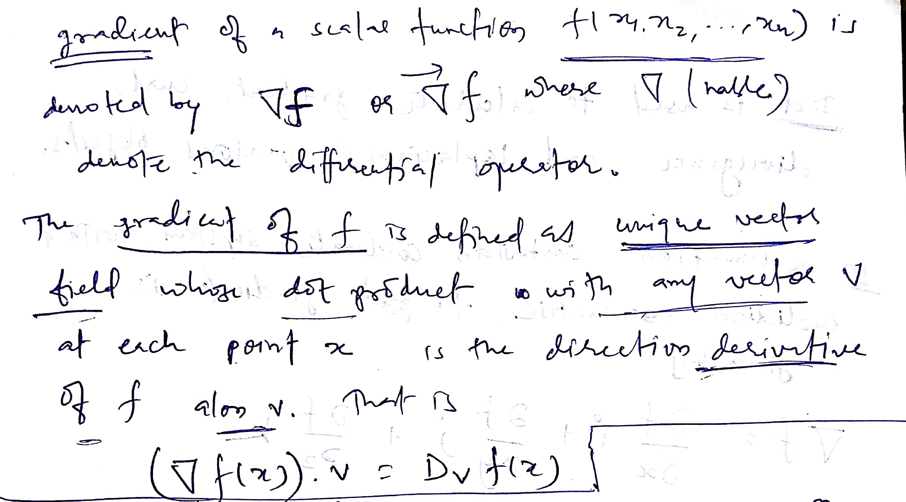
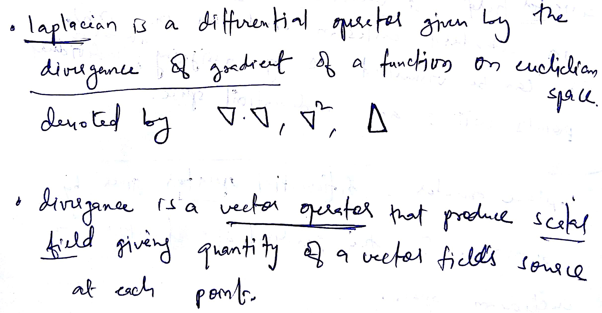

## Vector Field

## Del operator

## Differential Operators

## Euler–Lagrange equation
In the calculus of variations, the Euler–Lagrange equation, Euler's equation, or Lagrange's equation, is a second-order partial differential equation whose **solutions are the functions** for which a given functional is stationary. 

