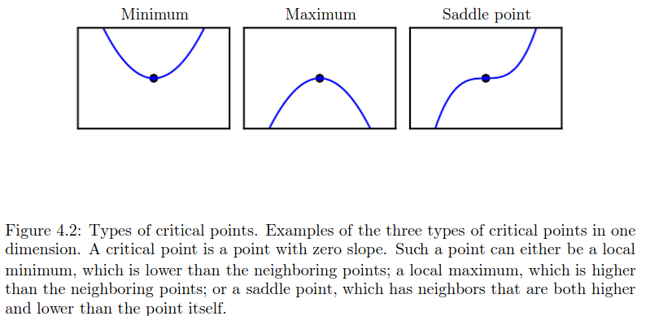
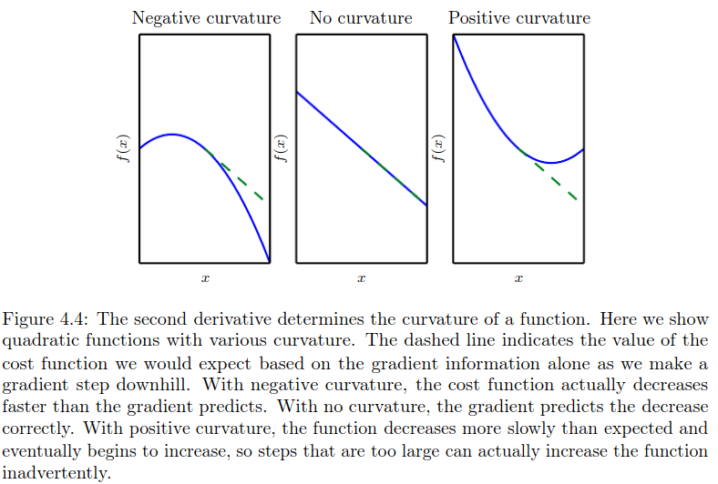
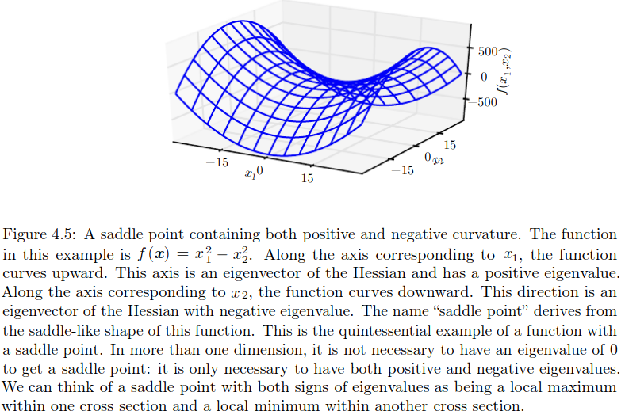
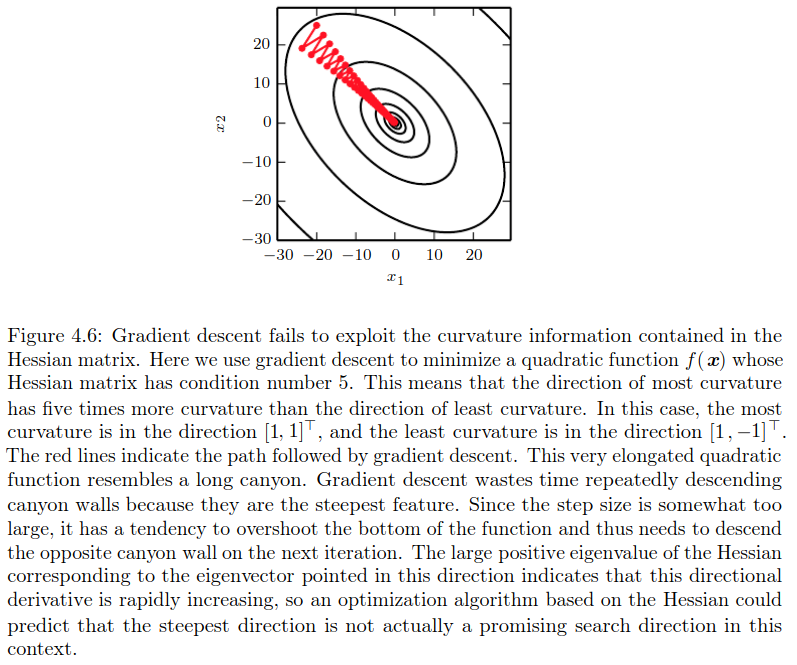
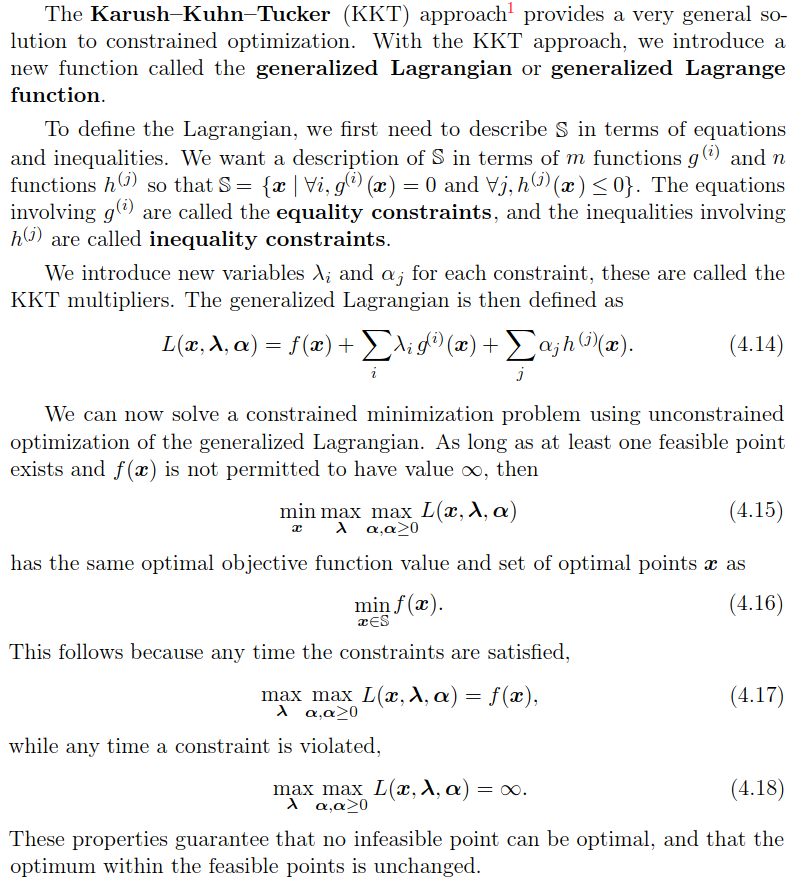

# 4 Numerical Computation
**A**
## 4.1 Overflow and Underflow

## 4.2 Poor conditioning

## 4.3 Gradient Based Optimization
**A**

## 4.4 Constrained Optimization
**A**
The KKT approach generalizes the method of Lagrange multipliers, which allows equality constraints but not inequality constraints.

## 4.5 Example of Linear Least Square

