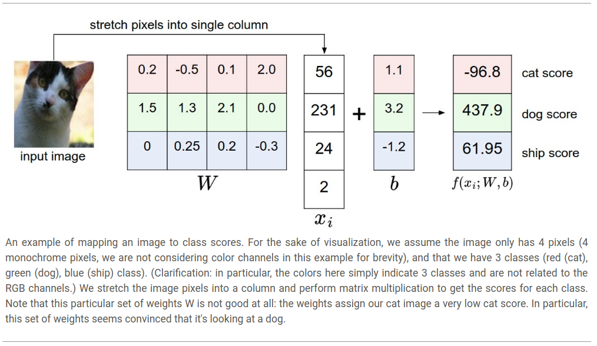
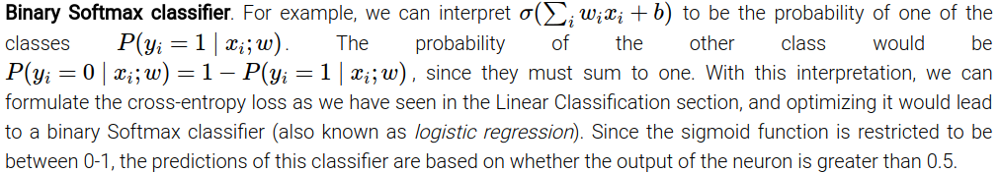

# Machine learning Basics

## 5.1 Learning Algorithm
**A**

## 5.2 Capacity, Overfitting, Underfitting
**A**

## 5.3 Hyper-Parameters and Validation Set

## 5.7 Supervised Learning 
**A**

## 5.8 Unsupervised Learning 
**A**

## 5.9 Stocastic Gradient Decent

## 5.10 Building a Machine Learning Algo

## 5.11 Challenges Motivating Deeplearning