# Deep Feedforward Networks

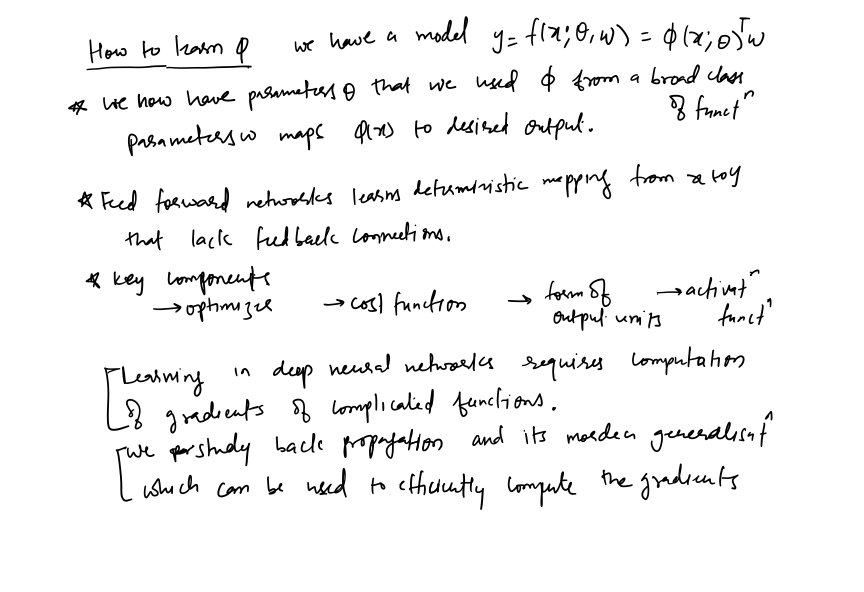
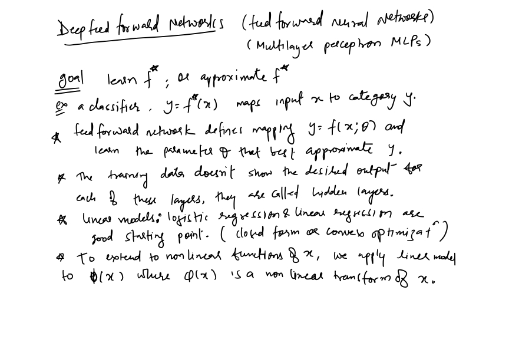

## Example: learning XOR
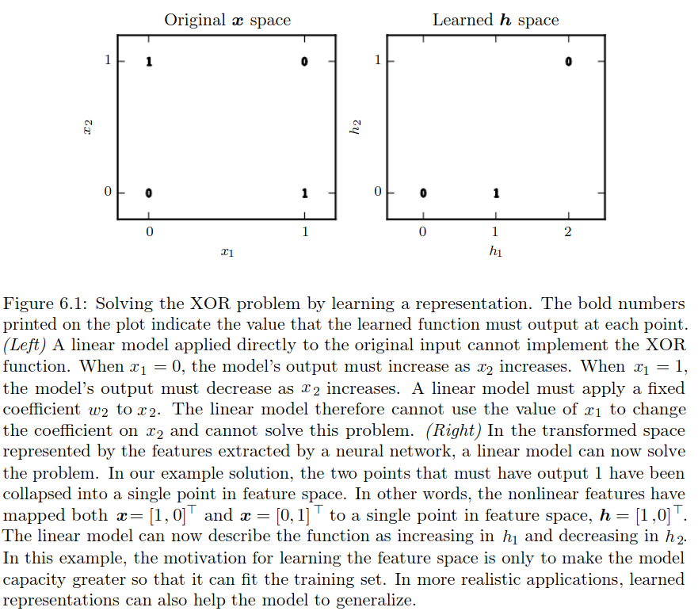
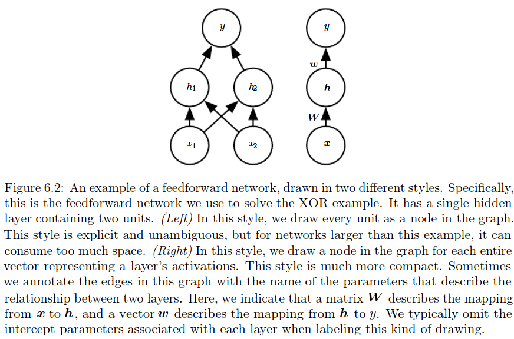
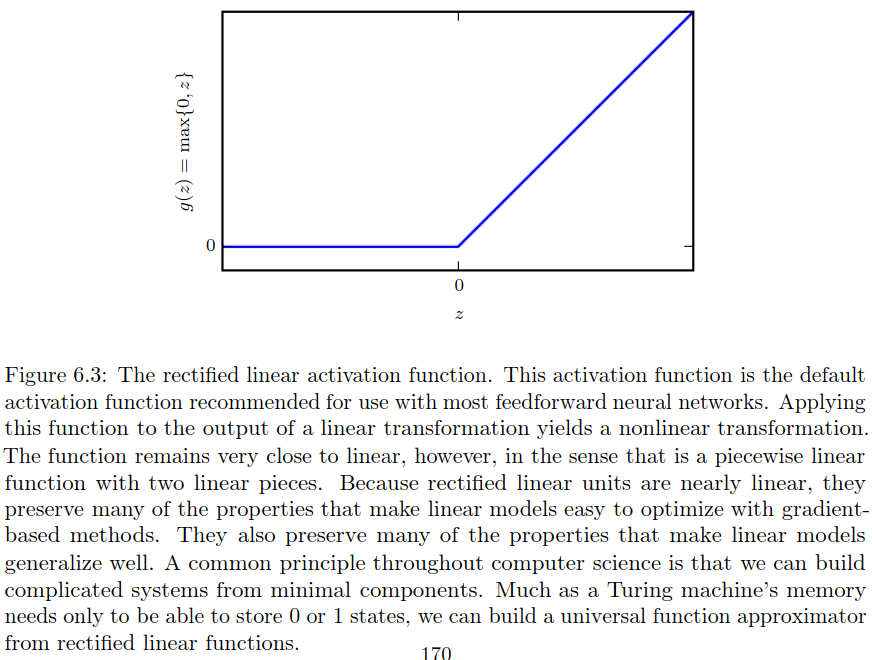
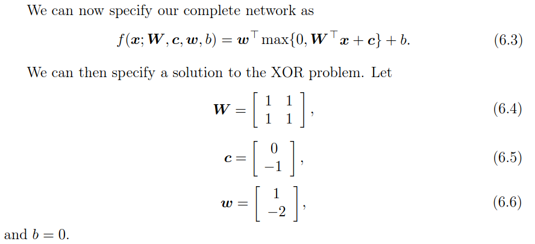

## Gradient based learning
### Learning Conditional Distributions with Maximum Likelihood
Most modern neural networks are trained using maximum likelihood. This meansthat the cost function is simply the negative log-likelihood, equivalently describedas the cross-entropy between the training data and the model distribution. Thiscost function is given by:

$$
J(\theta) = - E_{x,y \approx \hat{p}_{data}} \log p_{model} (y|x)
$$

### Learning Conditional Statistics
Instead of learning a full probability distribution $p(y | x;\theta)$, we often want tolearn just one conditional statistic of y given x.

For example, we may have a predictor $f(x;\theta)$ that we wish to employ to predictthe mean of $y$. From this point of view, wecan view the cost function as being afunctionalrather than just a function. 

Another example, we can design the cost functional to have itsminimum lie on the function that mapsxto the expected value of $y$ given $x$. Solving an optimization problem with respect to a function requires a mathematicaltool called calculus of variations.

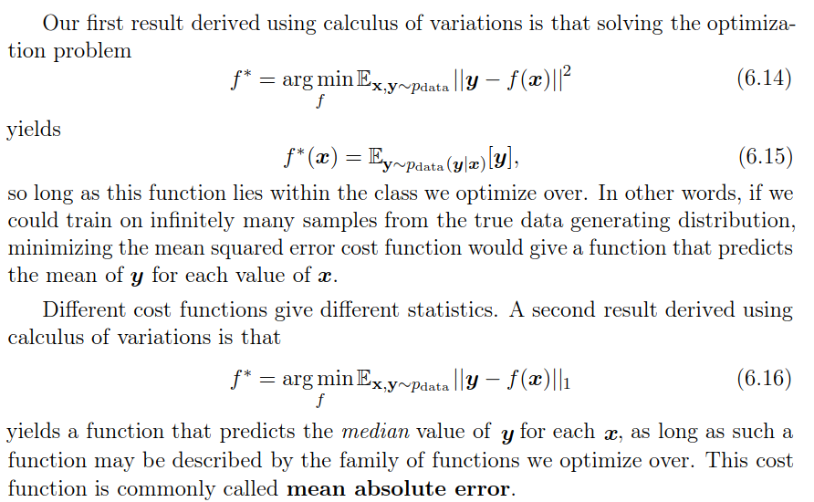

Unfortunately, mean squared error and mean absolute error often lead to poor results when used with gradient-based optimization. Some output units that saturate produce very small gradients when combined with these cost functions.This is one reason that the cross-entropy cost function is more popular than mean squared error or mean absolute error, even when it is not necessary to estimate an entire distribution $p(y | x)$.

### Output type
The choice of cost function is tightly coupled with the choice of output unit. Mostof the time, we simply use the cross-entropy between the data distribution and themodel distribution. The choice of how to represent the output then determinesthe form of the cross-entropy function.Any kind of neural network unit that may be used as an output can also beused as a hidden unit. Here, we focus on the use of these units as outputs of themodel, but in principle they can be used internally as well.

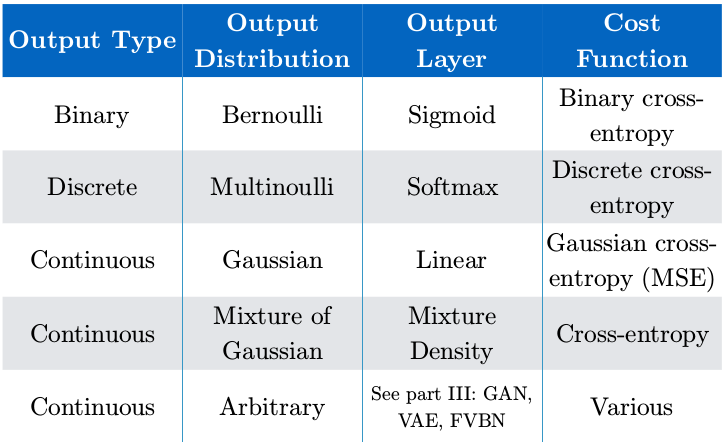
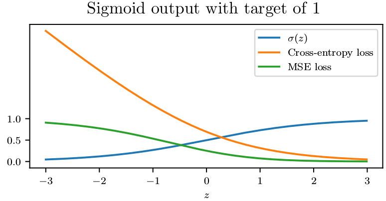
## Hiddent units 
most hidden units can be described as acceptinga vector of inputsx, computing an affine transformation $z=W^T x+b$, and then applying an element-wise nonlinear function $g(z)$. Most hidden units are distinguished from each other only by the choice of the form of the activation function $g(z)$.

Rectified linear units use the activation function $g(z) = max \{\theta, z\}$. Note that it is not differentiable at $z=0$ because the left and the right limits are not equal. However in practice, we can safely disregard the non differentiability of the hidden unit activation functions. A varient of Relu is leaky relu which is differentiable. 

Prior tp Relu, most neural networks used logistic sigmoid activation function $g(z)=\sigma (z)$ or the hyperbolic tengent activation function $g(z)=tanh(z)$. These activation function are closely related because $tanh(z) = 2 \sigma (2z) - 1$.
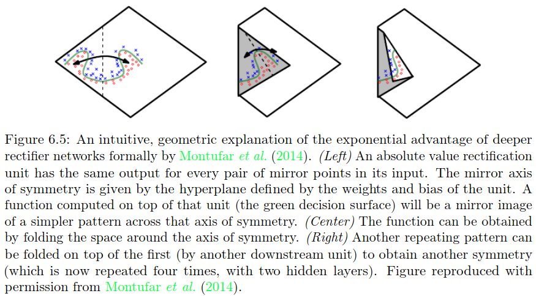
Unlike piecewise linear units, sigmoidal units saturate across most of their domain—they saturate to a high value when $z$ is very positive, saturate to a low value whenzis very negative, and are onlystrongly sensitive to their input when $z$ is near $\theta$. The widespread saturation of sigmoidal units can make gradient-based learning very difficult. For this reason,their use as hidden units in feedforward networks is now discouraged. However, Recurrent networks, many probabilistic models, and some autoencoders have additional requirements that rule out the use of piece wise linear activation functions and make sigmoidal units more appealing despite the drawbacks of saturation.

## Universal approximation theorem
The universal approximation theorem(Horniket al., 1989; Cybenko, 1989) states that a feedforward network with a linear outputlayer and at least one hidden layer with any “squashing” activation function (suchas the logistic sigmoid activation function) can approximate any Borel measurablefunction from one finite-dimensional space to another with any desired nonzeroamount of error, provided that the network is given enough hidden units. Thederivatives of the feedforward network can also approximate the derivatives of thefunction arbitrarily well (Hornik et al., 1990).

In summary, a feedforward network with a single layer is sufficient to representany function, but the layer may be infeasibly large and may fail to learn andgeneralize correctly. In many circumstances, using deeper models can reduce thenumber of units required to represent the desired function and can reduce theamount of generalization error.
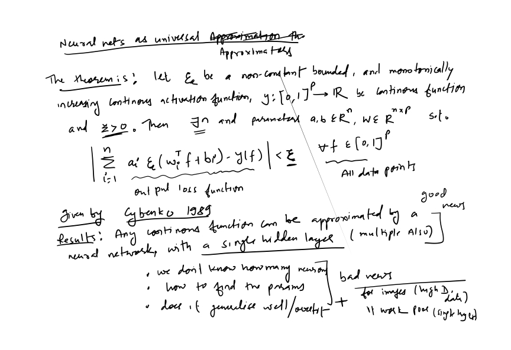

## Backpropagation and other differentiation

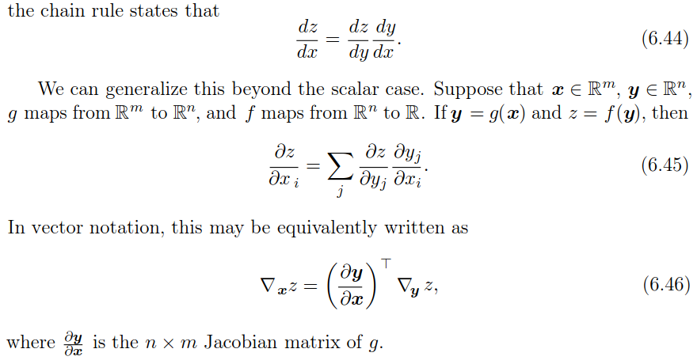
Usually we apply the back-propagation algorithm to tensors of arbitrary di-mensionality, not merely to vectors. Conceptually, this is exactly the same asback-propagation with vectors. The only difference is how the numbers are ar-ranged in a grid to form a tensor. We could imagine flattening each tensor intoa vector before we run back-propagation, computing a vector-valued gradient,and then reshaping the gradient back into a tensor. In this rearranged view,back-propagation is still just multiplying Jacobians by gradients.

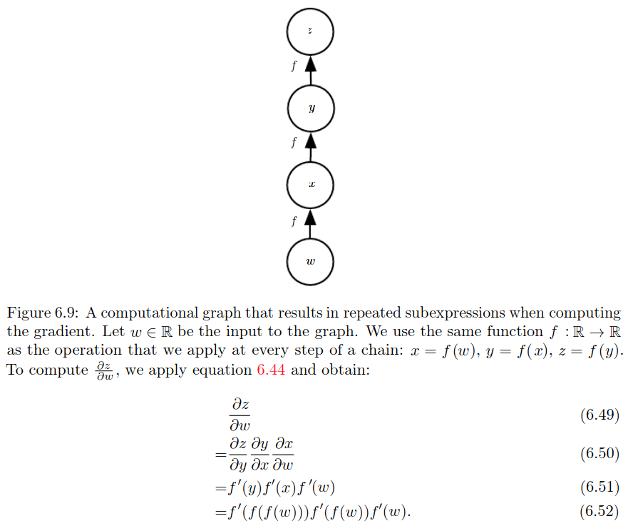
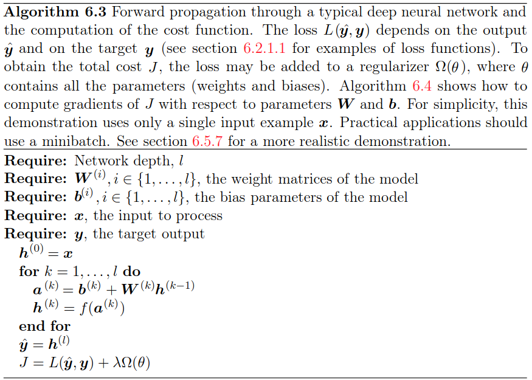
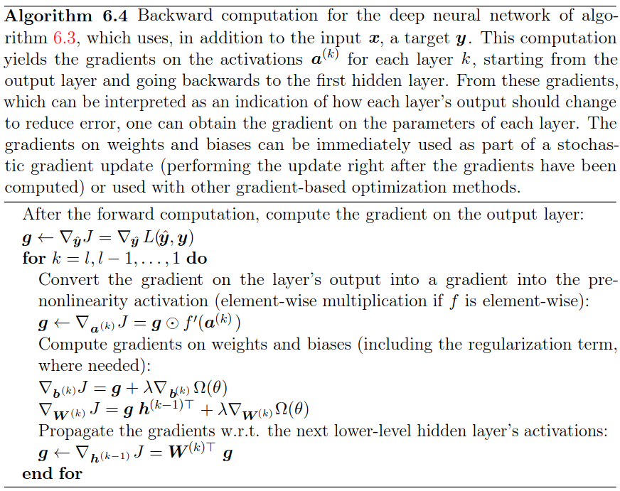
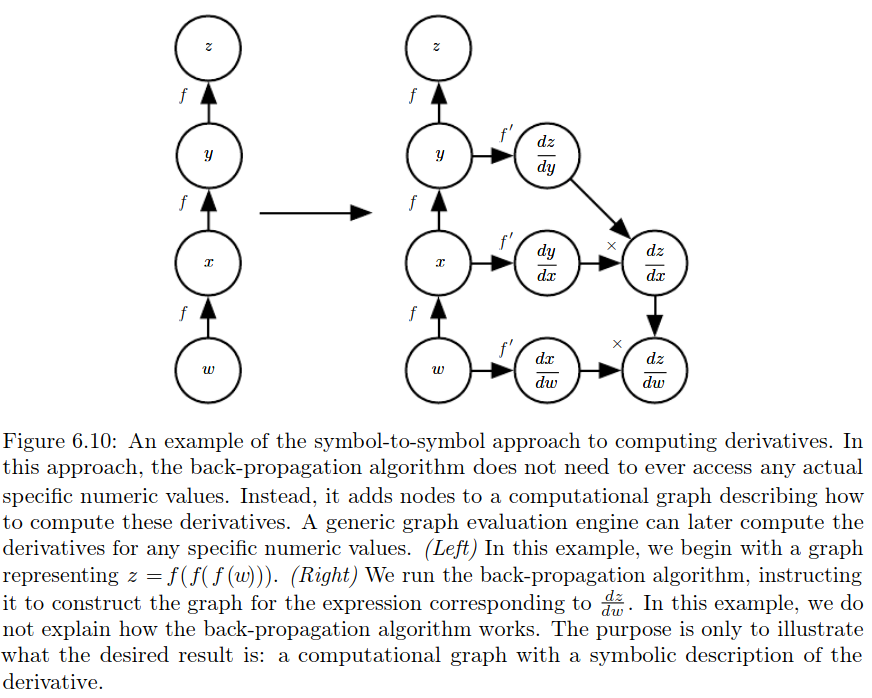
## Historical notes