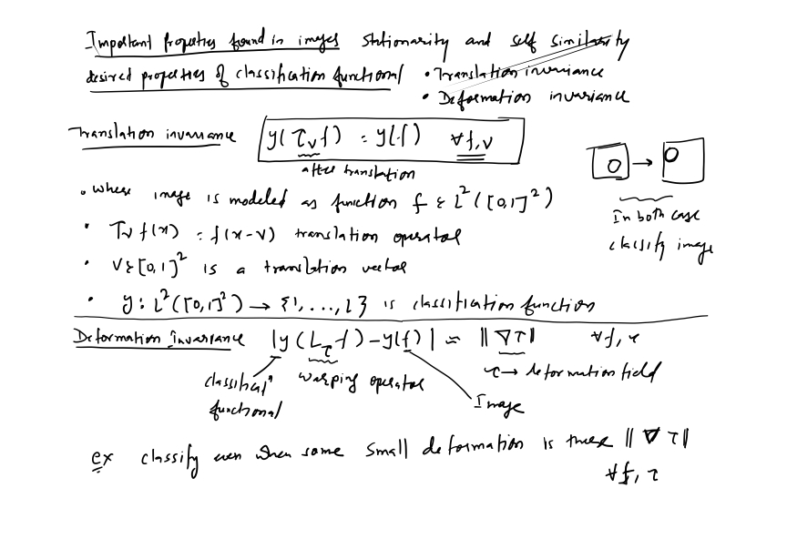
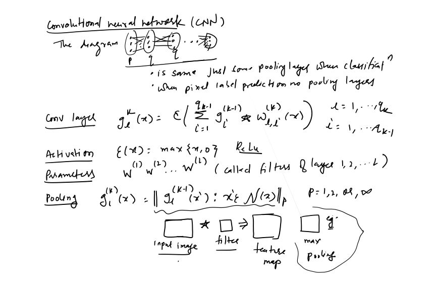
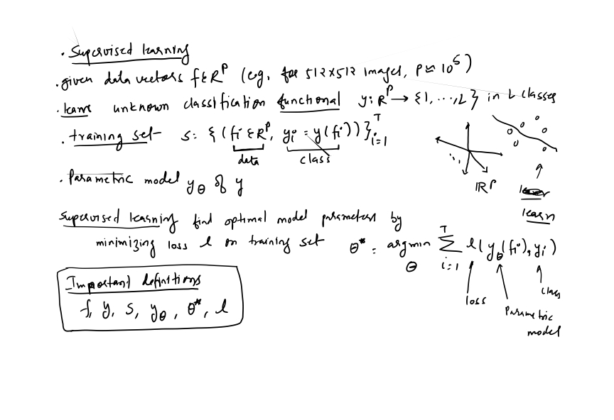
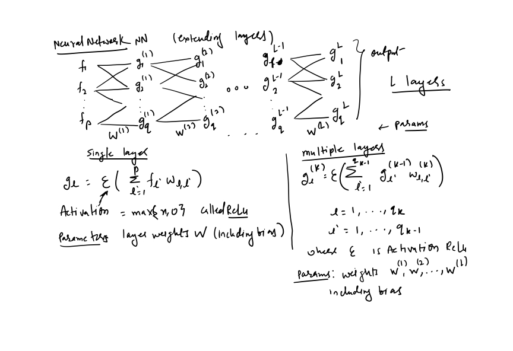
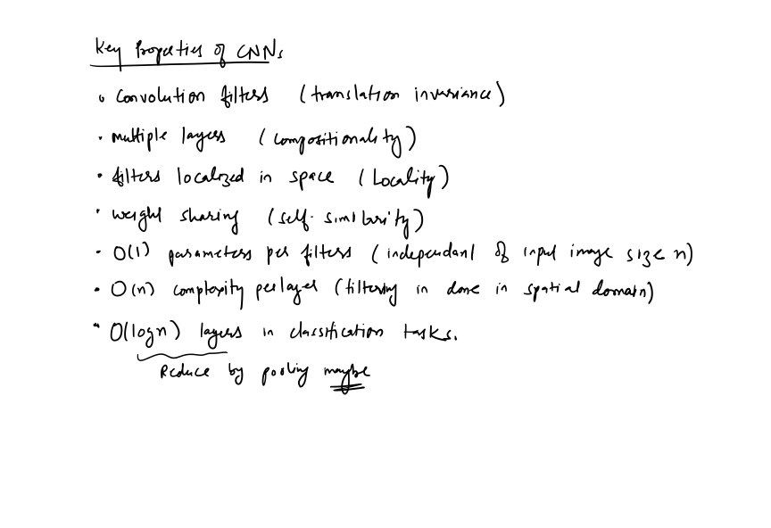

## The Convolution Operation 

## Motivation

## Pooling

## Convolution And Pooling as an Infinitely Strong Prior 

## Variants of the Basic Convolution Function

## Structured Outputs

## Data Types

## Efficient Convolution Algorithms 

## Random or Unsupervised Features

## The Neuroscientific Basis For Convolutional Network

## Convolutional Networks And The History Of Deep Learning 
