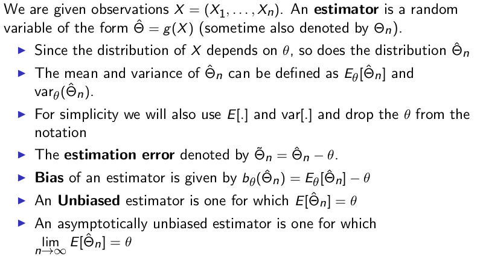
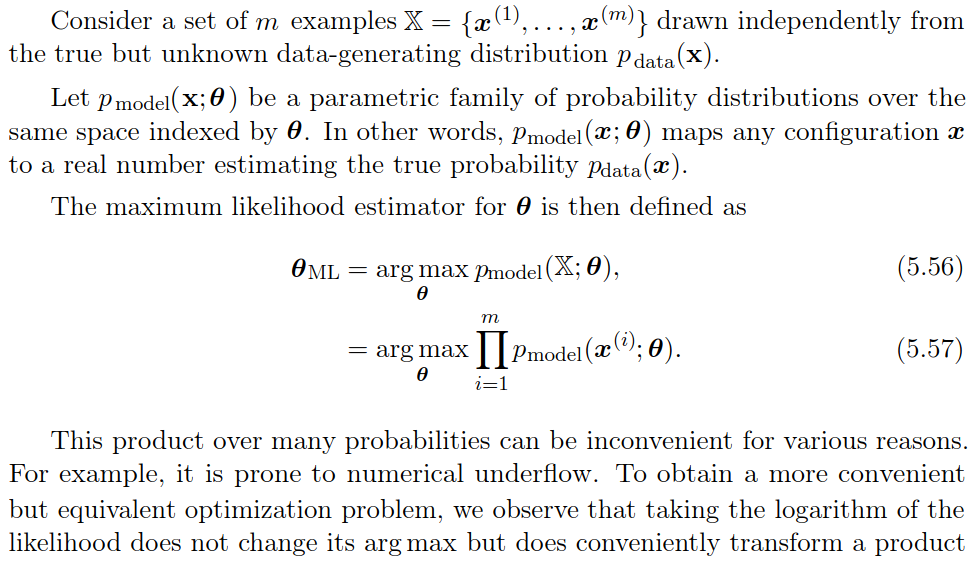
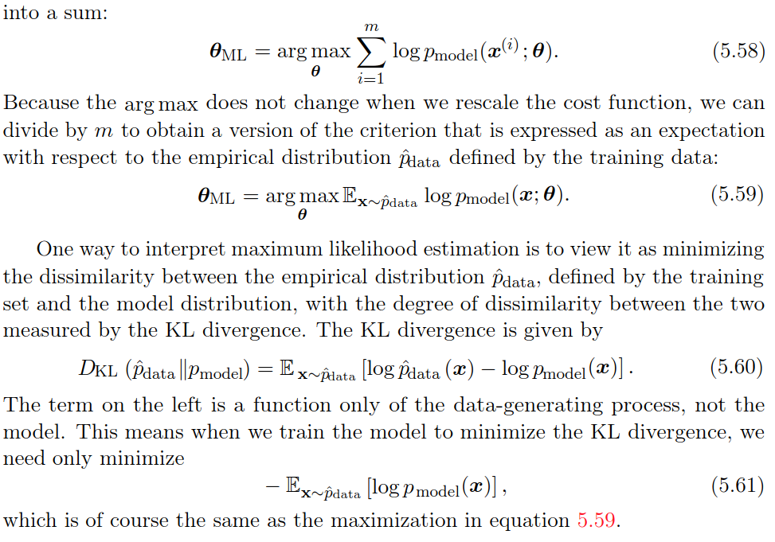
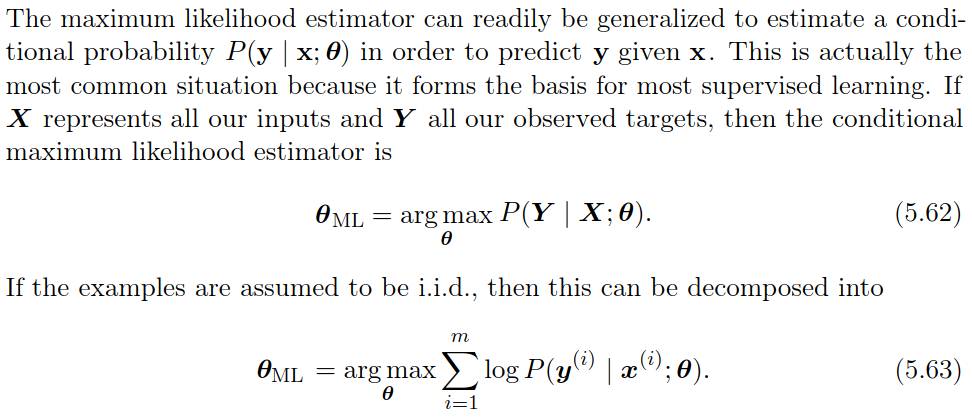
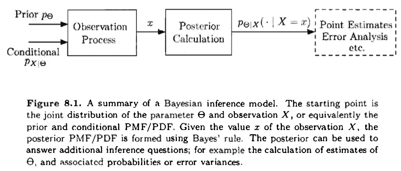
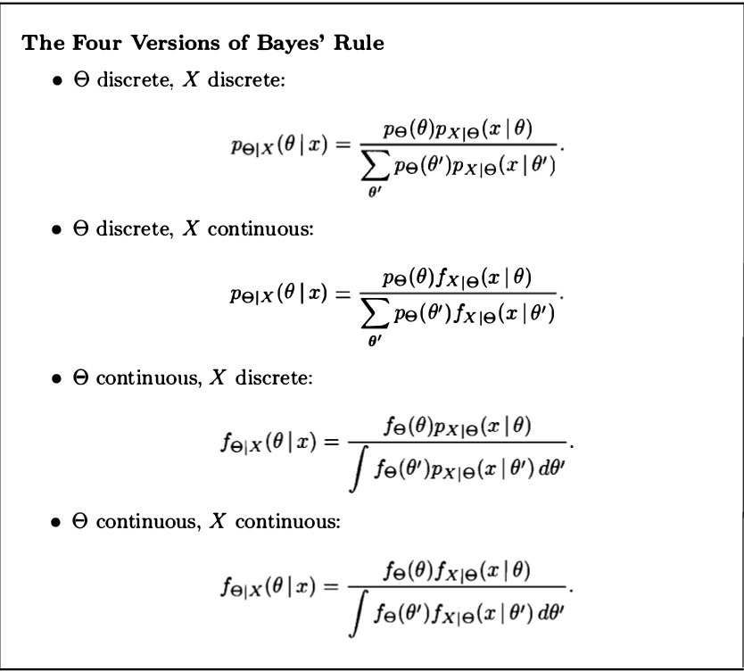
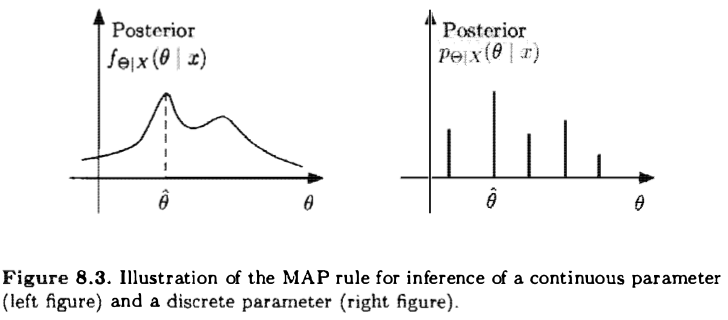

Checking latex. $$x$$ 

# Motivation: Probability V/S Statistics 
**_What we want to do ? -- we want to determine some unknown quantity._**

Statistics need to calculate some parameters to show that results are close to true value of the unknown however probability problem revolves around calculating the actual values. The difference between the **Bayesian** and **classical statistics**:  Bayesian approach consider the unknown quantity as a random variable whereas the classical statistician will think of it as some constant value.

## Important definitions:
**_Here, first we give small definitions:_**

**Model inference**: a simple example  $y_i = x_i \theta + W$, where learning $\theta$ is model inference and learning $x_i$ from $y_i$ is variable inference ($\theta$ is known). for example: consider a noisy channel where sometimes we want to know the system estimation (attenuation $\theta$) or want to know the sound given $y_i$.

**variable inference**

**Estimate**: it to refer to the numerical value $\hat{\theta}$ that we choose to report on the basis of the actual observation $x$. The value of $\hat{\theta}$ is to be determined by applying some function $g$ to the observation $x$, resulting in $\hat{\theta} = g(x)$. 

**Estimator**: The random variable $\hat{\Theta} = g(X)$ is called an estimator, and its realized value equals $g(x)$ whenever the random variable $X$ takes the value $x$.

**Empirical distribution**: This contains the various measurements and data point. each data point is a random variable.

**True distribution**: when have some idea of the true distribution (can be approximated by a linear or polynomial regression ) then it is called the parametric setting, where as if we have no idea of true distribution accept it is some function of $X$, as $g(X)$, this is called the non-parametric setting.

**Model distribution**: After finishing the estimation process, we get some value of unknown quantity, in case of linear model we get slop and the intercept of the line to model $y_i = x_i \theta_1 + \theta_2$. 

**_Below, we give big (important) definitions:_**

#### Point estimate
Point estimation is the attempt to provide the single “best” prediction of somequantity of interest. In general the quantity of interest can be a single parameteror a vector of parameters in some parametric model, such as the weights in ourlinear regression example. To distinguish estimates of parameters from their true value, our conventionwill be to denote a point estimate of a parameter $\theta$ by $\hat{\theta}$.

Let ${x^{(1)}, . . . , x^{(m)}}$ be a set of $m$ independent and identically distributed data points. A point estimator or statistic is any function of the data:
$$
\hat{\theta_m} = g(x^{(1)}, . . . , x^{(m)}).
$$

#### Function Estimation 
Sometimes we are interested in performing functionestimation (or function approximation). Here, we are trying to predict a variableygiven an input vectorx. We assume that there is a functionf(x) that describesthe approximate relationship betweenyandx. For example, we may assume that $y=f(x) +\epsilon$, where $\epsilon$ stands for the part of $y$ that is not predictable from $x$. In function estimation, we are interested in approximating $f$ with a model or estimate $\hat{f}$. Function estimation is really just the same as estimating a parameter $\theta$; the function estimator $\hat{f}$ is simply a point estimator in function space. The linear regression example and the polynomial regression example both illustrate scenarios that may be interpreted as either estimating a parameter $w$ or estimating a function $\hat{f}$ mapping from $x$ to $y$.

#### Hypothesis testing
An unknown parameter takes a finite number of values. One wants to find the best hypothesis based on the data. e.g. binary hypothesis problem or m-ary hypothesis problem. 

#### Non-parametric
If we have no idea of true distribution accept it is some function of $X$, as $g(X)$, this is called the non-parametric setting.

#### Statistical Inference 
The problems are divided as:

- Clasical statistical inference
- Bayesian statistical inference

##### Clasical statistical inference

- The parameter(s) $\theta$ is fixed and unknown
- Data is generated through the likelihood function $p(X ;\theta)$ (if discrete) or $f(X ; \theta)$ (if continuous).
- Now we will be dealing with multiple candidate models, one for each value of $\theta$
- We will use $E_\theta[h(X)]$ to define the expectation of the random variable $h(X)$ as a function of parameter $\theta$.
- MLE

##### Bayesian statistical inference

## Maximum Likelihood Estimation (Clasical statistical inference)

### Example: Linear Regression as Maximum Likelihood 

## Bayesian statistical inference

**Summary of Bayesian Inference:**

- We start with a prior distribution $p_\Theta$ or $f_\Theta$ for the unknown random variable $\Theta$.
- We have a model $p_{X|\Theta}$ or $f_{X|\Theta}$ of the observation vector $X$.
- After observing the value $x$ of $X$ , we form the posterior distribution of $\Theta$, using the appropriate version of Bayes' rule.

**Two of the most popular estimators:**

- **Maximum a Posteriori Probability (MAP) estimator**: Here, having observed $x$, we choose an estimate $\hat{\theta}$ that maximizes the posterior
distribution over all $\theta$. When posterior distribution $\Theta$ is discreate or continous then we define $\hat{\theta}$ as follows:
$$
\hat{\theta}  = \underset{\theta}{\operatorname{argmax}} p_{\Theta|X}(\theta|x)
$$

$$
\hat{\theta} = \underset{\theta}{\operatorname{argmax}} f_{\Theta|X}(\theta|x)
$$

 If $\Theta$ is continuous, the actual evaluation of the MAP estimate $\theta$ can some­ times be carried out analytically; for example, if there are no constraints on $\theta$, by setting to zero the derivative of $f_{\Theta|X}(\theta|x)$, or of $\log f_{\Theta|X}(\theta|x)$, and solving for $\theta$.

The MAP rule maximizes the overall probability of a correct decision over all decision rules $g$. 
$$
P(g(X) = \Theta) \leq P(g_{MAP}=\Theta)
$$
Note that this argument is mostly relevant when $\Theta$ is discrete. If $\Theta$, when conditioned on $X = x$, is a continuous random variable. the probability of a correct decision is 0 under any rule.

- **The Conditional Expectation estimator**: Here, we choose the estimate $\hat{\theta} = E[\Theta | X = x ]$ (In case of continuous expectation is calculated because probability of individual $\theta$ is zero in continuous probability space.).

Our aim is to get the ($\theta$, Probability)-plot where we have probability space for various value of $\theta$. As describe below:

If the posterior distribution of $\Theta$ is symmetric around its (conditional) mean and unimodal (i.e. , has a single maximum) , the maximum occurs at the mean. Then, the MAP estimator coincides with the conditional expectation estimator. This is the case, for example, if the posterior distribution is guaranteed to be normal.

### Bayesian least mean square: 
Least mean squares (LMS) estimation: Select an estimator /fun­ction of the data that minimizes the mean squared error between the parameter and its estimate
### Bayesian linear least mean square estimation: 
Selects an estimator which is a liner function of the data and minimizes the mean squared error between the parameter and its estimate. 	

## Some cool problems/derivations:

- Inference of common mean of normal random variables.
- Beta priors on the Bias of a coin.
- Multi parameter problems using sensor network.

